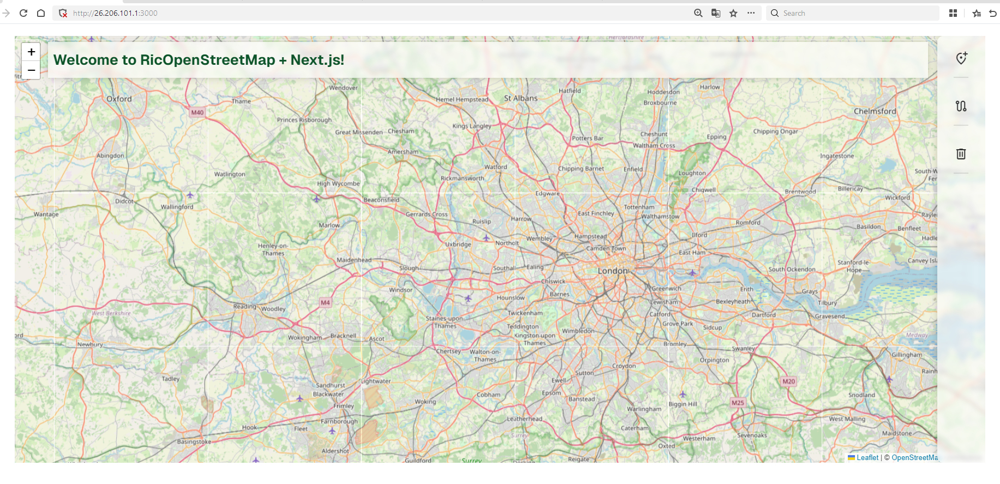

# Ejemplo de proyecto en next/javascript usando openStreetMap 

> en un principio esto sera un ejemplo de como usarlo pero quisa vaya integrandole mas cosas,
> como una barra de herramientas para dibujar en el mapa quisa poco mas
> quien sabe, el futuro es incierto.

## Actualmente posee un visor del mapa con componentes de herramientas y un titulo con desarrollo futuro

